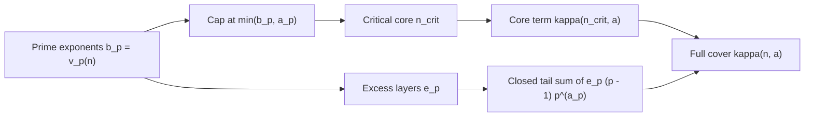
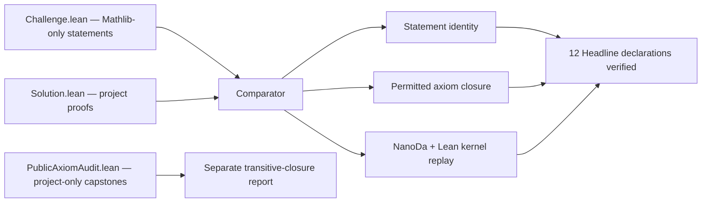

<!--
Copyright (c) 2026 Adam McKenna. All rights reserved.
Released under Apache 2.0 license as described in the file LICENSE.
Author: Adam McKenna <adam@mysticflounder.ai>
-->

# Prime-power structure of the stable regime for modular Schur numbers

This repository provides a Lean 4 formalization of modular Schur numbers
$S_m(k,\ell)$, the greatest $N$ admitting a $k$-coloring of $1,\ldots,N$ with
no monochromatic solution of $x_1+\cdots+x_\ell\equiv y\pmod m$; repeated
summands are allowed. For $m\ge2$ and $\ell\ge2$, with
$n=m/\gcd(m,\ell-1)$, its main theorem proves
$S_m(k,\ell)=n-1$ for every $k\ge n-1$. Comparator-gated Mathlib-only
structural statements are distinct from the separately audited, hand-written,
generated-independent public project layer. An earlier generated
`native_decide` scan tree is absent from the public release and outside both
verification scopes.

Modular Schur numbers belong to **Ramsey theory**, **additive combinatorics**,
and **combinatorial number theory**. The forbidden congruence concerns additive
structure and sum-free sets in the finite cyclic group $\mathbb Z/m\mathbb Z$;
maximizing $N$ makes the problem extremal. The canonical-cover proofs also use
finite set cover, hypergraph transversals, and incidence combinatorics. The
project metadata lists the broad arXiv areas `math.CO` and `math.NT` and the
more specific MSC2020 classifications in
[`formalization.yaml`](formalization.yaml).

The stable-regime closed form is finished. For $m\ge 2$ and $\ell\ge 2$, put
$n=m/\gcd(m,\ell-1)$. The project proves

$$
S_m(k,\ell)=n-1\qquad\text{for every }k\ge n-1.
$$

Here *closed form* means exactly that one explicit expression produces the
stable value directly from $m$ and $\ell$ in a fixed number of elementary
steps: one gcd, one division, and one subtraction. It requires no search over
colorings, no recursion, and no case split on $\ell\bmod m$; one rule replaces
the earlier modulus-by-modulus tables.

It also proves the exact one-color value
$S_m(1,\ell)=\min(\ell-1,\lfloor m/\ell\rfloor)$ for $2\le\ell\le m$, the
integer-to-residue bridge, the matching upper and lower bounds, and the
$\sigma_\infty$ coset-cardinality bound. Twelve of these results are restated
using Mathlib vocabulary alone and checked by
[`leanprover/comparator`](https://github.com/leanprover/comparator). The latest
Lean-bearing public release passed statement comparison, the configured axiom
policy, and replay through both the Lean and `nanoda` kernels in
[run 33438151044](https://github.com/mysticflounder/modular-schur/actions/runs/33438151044).

The conformance workflow also runs
`lake build ModularSchur.PublicAxiomAudit`, which builds
[`ModularSchur.PublicAxiomAudit`](lean/ModularSchur/PublicAxiomAudit.lean), a
`#print axioms` module for the broader project-only layer. Building it
elaborates the named declarations and surfaces their transitive axiom closures
in the CI log for review; it does not automatically enforce an axiom whitelist
or fail merely because a custom axiom appears. This is independent of the
Comparator/`nanoda` gate, which still checks exactly the twelve declarations in
the `Headline` namespace.

A second, project-only layer develops exact-cover and canonical-axis machinery.
Its audited capstones give the exact support-one seed count, stable-prime
residual transport, the recurrence
$\kappa(pn,a)=\kappa(n,a)+(p-1)p^{a_p}$ for a prime $p$, $n\ne0$, and
$a_p\le v_p(n)$, prime-power iteration, and the unrestricted reduction to an
exponent-truncated critical core. Those results are kernel checked and publicly
packaged, but they aren't silently included in the twelve-statement Comparator
configuration.

The main closed form is complete. The general least-color threshold
$k_0(m,\ell)$ isn't. The current cover theory also doesn't construct the
two-axis matching certificate merely from support cardinality two. An earlier
generated route and the SAT census have separate trust boundaries and aren't
part of the structural theorem's proof. Checked by Lean, checked by SAT, and
conjectured are three different things here.

The [paper](https://mysticflounder.github.io/modular-schur/) is a fixed
snapshot. The living [research status
record](https://mysticflounder.github.io/modular-schur/status.html) states what
is proved, computed, refuted, and still open; when they differ, the status
record supersedes the PDF. [`LEAN_STATUS.md`](LEAN_STATUS.md) is the
package-by-package authority for the public Lean release.

---

## One complete period at m = 12

For $m=12$, the proved high-color value depends on $\ell$ only through
$d=\gcd(12,\ell-1)$ and $n=12/d$. The pattern repeats under
$\ell\mapsto\ell+12$, so $2\le\ell\le13$ is one complete period within the
theorem's range:

| ℓ | ℓ − 1 | d | n | Proved high-color value |
|---:|---:|---:|---:|---:|
| 2 | 1 | 1 | 12 | `S₁₂(k, 2) = 11 for k ≥ 11` |
| 3 | 2 | 2 | 6 | `S₁₂(k, 3) = 5 for k ≥ 5` |
| 4 | 3 | 3 | 4 | `S₁₂(k, 4) = 3 for k ≥ 3` |
| 5 | 4 | 4 | 3 | `S₁₂(k, 5) = 2 for k ≥ 2` |
| 6 | 5 | 1 | 12 | `S₁₂(k, 6) = 11 for k ≥ 11` |
| 7 | 6 | 6 | 2 | `S₁₂(k, 7) = 1 for k ≥ 1` |
| 8 | 7 | 1 | 12 | `S₁₂(k, 8) = 11 for k ≥ 11` |
| 9 | 8 | 4 | 3 | `S₁₂(k, 9) = 2 for k ≥ 2` |
| 10 | 9 | 3 | 4 | `S₁₂(k, 10) = 3 for k ≥ 3` |
| 11 | 10 | 2 | 6 | `S₁₂(k, 11) = 5 for k ≥ 5` |
| 12 | 11 | 1 | 12 | `S₁₂(k, 12) = 11 for k ≥ 11` |
| 13 | 12 | 12 | 1 | `S₁₂(k, 13) = 0 for k ≥ 0` |

The displayed color bound is the sufficient range of the proved theorem. The
table does not claim that it is the least possible $k$ in every row; determining
that least-color threshold is the separate open problem discussed below.

The header figure is the paper's diagram of this collapse. It illustrates the
closed form; it isn't computational evidence for it.

---

## What is formalized

The project-facing declarations use the definitions in `ModularSchur`. The
Comparator-facing declarations under `Headline` expand those definitions into
Mathlib terms, allowing a reviewer to inspect the claimed statements without
trusting a project-defined abbreviation.

### Stable closed form: [`ModularSchur.schurMod_eq`](lean/ModularSchur/IntegerBridge.lean#L190)

> For $m\ge2$, $\ell\ge2$, and
> $k\ge m/\gcd(m,\ell-1)-1$, the modular Schur number is
> $m/\gcd(m,\ell-1)-1$.

```lean
theorem schurMod_eq (m k ℓ : ℕ) (hm : 2 ≤ m) (hℓ : 2 ≤ ℓ)
    (hk : m / Nat.gcd m (ℓ - 1) - 1 ≤ k) :
    schurMod m k ℓ = m / Nat.gcd m (ℓ - 1) - 1
```

The Mathlib-only statement is
[`Headline.schurMod_eq`](lean/comparator/Challenge.lean#L72). The companion
theorem `schurMod_is_greatest` proves that the bounded `Nat.findGreatest`
presentation used there still expresses the unbounded greatest-$N$ definition.

### One-color closed form: [`ModularSchur.schurModResidue_k1`](lean/ModularSchur/K1Theorem.lean#L173)

> For $2\le\ell\le m$, one color reaches exactly the smaller of the no-wrap
> bound $\ell-1$ and the wraparound bound $\lfloor m/\ell\rfloor$.

```lean
theorem schurModResidue_k1 (m ℓ : ℕ) (hm : 2 ≤ m)
    (hℓ : 2 ≤ ℓ) (hlm : ℓ ≤ m) :
    schurModResidue m 1 ℓ = min (ℓ - 1) (m / ℓ)
```

This resolves D'orville–Sim–Wong–Ho Problem 1.3 and is one of the twelve
Comparator-gated declarations.

### Exponent-truncated critical core: [`CanonicalCriticalCore`](lean/ModularSchur/CanonicalCriticalCore.lean#L255)

This is an exact prime-adic kernelization of the canonical finite set-cover
problem used in the stable-threshold analysis. Let

$$
\kappa(n,\mathbf a)
=\mathrm{axis\_cover}(\mathrm{canonicalExtensionalFamily}(n,\mathbf a)),
$$

the minimum number of distinct canonical axis neighborhoods needed to cover
the terminal universe $\{1,\ldots,n-1\}$. For each prime $p\mid n$, write
$b_p=v_p(n)$ and let $a_p$ be its prescribed active depth. The critical core
keeps only the first $\min(b_p,a_p)$ valuation layers:

$$
n_{\mathrm{crit}}
=\prod_{p\mid n}p^{\min(b_p,a_p)}.
$$

The number of removed $p$-layers is
$e_p=b_p-\min(b_p,a_p)$. Each one has the same closed cover cost
$(p-1)p^{a_p}$, and Lean proves, for every $n\ne0$ and every depth profile
$\mathbf a$,

$$
\boxed{
\kappa(n,\mathbf a)
=\kappa(n_{\mathrm{crit}},\mathbf a)
+\sum_{p\mid n}e_p(p-1)p^{a_p}.
}
$$



There are three useful boundary cases:

- if $a_p\ge b_p$, that prime loses no layers and contributes zero;
- if $0<a_p<b_p$, the core retains $p^{a_p}$ and removes the remaining
  $b_p-a_p$ layers;
- if $a_p=0$, the prime disappears from the core and contributes
  $b_p(p-1)$.

For example, take $n=72=2^3\cdot3^2$ with $a_2=a_3=1$. Then
$n_{\mathrm{crit}}=2\cdot3=6$, the removed $2$-layers contribute $4$, and
the removed $3$-layer contributes $6$. The theorem gives
$\kappa(72,\mathbf a)=\kappa(6,\mathbf a)+10$.

```lean
theorem axisCover_canonicalExtensionalFamily_eq_exponentTruncatedCore_add_excess_unrestricted
    (n : ℕ) (a : ℕ → ℕ) (hn0 : n ≠ 0) :
    axis_cover (canonicalExtensionalFamily n a) =
      axis_cover (canonicalExtensionalFamily (exponentTruncatedCore n a) a) +
        excessExponentContribution n a
```

The word *critical* means that every prime-exponent tail outside this divisor
has been evaluated in closed form; all remaining covering complexity is
concentrated on $n_{\mathrm{crit}}$. The theorem does not evaluate that final
core cover, compute the residual term universally, or determine the general
least-color threshold $k_0(m,\ell)$. It is a theorem about the canonical cover
family, not directly about $S_m(k,\ell)$.

This final consumer is independently audited in the project-only layer, with
axiom closure exactly `{propext, Classical.choice, Quot.sound}`. It isn't one
of the twelve statements currently compared against a Mathlib-only
restatement.

---

## Proof status

The stable closed form and all twelve published Comparator statements are
proved without `sorryAx`, custom axioms, `native_decide`, or an unsafe/external
implementation boundary. Their transitive axiom closure is contained in, and
for the named headline results measured as, exactly
`{propext, Classical.choice, Quot.sound}`.

The public release uses four status classes:

- **Comparator-gated**: a Mathlib-only Challenge statement and project-backed
  Solution statement pass export comparison, the configured axiom policy, and
  both kernel replays.
- **Independently audited Lean proof**: a named project theorem received a
  separate statement/import/build/axiom review but has no current Mathlib-only
  Comparator entry.
- **Kernel-checked project theorem**: the declaration builds without a proof
  placeholder and feeds the public package, but no separate statement-fidelity
  review is claimed for that individual helper.
- **Adapter only**: the displayed implication is proved, but a producer for one
  of its hypotheses is still open.

### Comparator-gated layer

[`lean/comparator/Challenge.lean`](lean/comparator/Challenge.lean) imports only
`Mathlib` and contains the twelve claims as deliberate `sorry` stubs.
[`Solution.lean`](lean/comparator/Solution.lean) imports the project proofs and
discharges declarations with the same names and statements. The Comparator
checks the elaborated statements; the stubs aren't part of the Solution axiom
closure.



CI runs this gate on every push that changes the Lean project, Comparator
configuration, manifest/toolchain, or workflow. It rejects:

- `sorryAx` in a Solution result;
- an axiom outside `propext`, `Classical.choice`, and `Quot.sound`;
- generated native-evaluation axioms such as
  `declaration._native.native_decide.ax_*`;
- any Challenge/Solution statement mismatch.

### Project-only public layer

The curated public project layer contains 27 hand-written,
generated-independent modules plus
[`PublicAxiomAudit.lean`](lean/ModularSchur/PublicAxiomAudit.lean). The exact
allowlist is [`lean/PUBLIC_MODULES.txt`](lean/PUBLIC_MODULES.txt). The release
checker rejects generated imports, proof placeholders, project axioms,
unlisted project imports, `native_decide`, `Lean.ofReduceBool`,
`Lean.trustCompiler`, `unsafe`, `partial`, `extern`, and `implemented_by`
boundaries in that layer.

Finite computations retained in `TauClosure.lean` use kernel `decide`, including
the scoped concrete sections for
$d_0=110,220,440,880,1760,4400,8800$. Named project capstones have a transitive
axiom audit in `PublicAxiomAudit.lean`; [`LEAN_STATUS.md`](LEAN_STATUS.md) records
which consumers also received independent statement review. The module's
`#print axioms` commands are elaborated by its build and emit each named
declaration's transitive closure for review; the build itself does not
automatically whitelist-fail on custom axioms. This project-only audit remains
separate from the independent Comparator/`nanoda` gate for exactly twelve
`Headline` statements.

### The open frontier

The project does **not** claim a closed formula for the least number of colors
$k_0(m,\ell)$ at which the stable value begins for every composite parameter
pair. The critical-core theorem reduces one canonical-cover problem to a finite
exponent range, but it doesn't by itself prove a universal incidence-width
bound. Likewise, the two-axis modules turn an explicit matching certificate
into a transversal theorem; they don't construct that certificate from support
size two alone.

These are mathematical and formalization frontiers, not hidden placeholders in
the published stable closed-form proof.

### The computational lanes

The main theorem is elementary and doesn't depend on SAT. Separate census work
uses a CNF encoder, CaDiCaL, and DRAT replay. The original certificate tree is
about 121 GB and isn't distributed. No checksums for that original tree were
published, so running the scans again is a recomputation, not verification of
the original artifacts.

An earlier generated Lean route contained about 7,500 files and used
`native_decide`. Its results carried compiler-trust axioms and are deliberately
absent from this public repository and from the structural verification claim.

---

## Headline theorems

All twelve declarations in the first table are independently gated through
Mathlib-only statements. The second table records the principal project-only
packages; its exact per-consumer audit boundary is maintained in
[`LEAN_STATUS.md`](LEAN_STATUS.md).

### Comparator-gated structural results

| Theorem under `Headline` | Project theorem | Statement or role |
|---|---|---|
| [`schurMod_eq`](lean/comparator/Challenge.lean#L72) | `ModularSchur.schurMod_eq` | Main stable closed form, integer definition |
| [`schurMod_is_greatest`](lean/comparator/Challenge.lean#L87) | `ModularSchur.schurMod_is_greatest` | The `N ≤ m-1` search cap is lossless |
| [`no_valid_partition_of_ge_m`](lean/comparator/Challenge.lean#L105) | `ModularSchur.no_valid_partition_of_ge_m` | No valid partition exists once `N ≥ m` |
| [`schurMod_eq_schurModResidue`](lean/comparator/Challenge.lean#L117) | `ModularSchur.schurMod_eq_schurModResidue` | Integer-to-residue reduction |
| [`schurModResidue_eq`](lean/comparator/Challenge.lean#L136) | `ModularSchur.schurModResidue_eq` | Main stable closed form, residue definition |
| [`schurModResidue_le`](lean/comparator/Challenge.lean#L150) | `ModularSchur.schurModResidue_le` | Stable-regime upper bound |
| [`le_schurModResidue`](lean/comparator/Challenge.lean#L163) | `ModularSchur.le_schurModResidue` | Stable-regime lower bound |
| [`singleton_sumFree_iff`](lean/comparator/Challenge.lean#L176) | `ModularSchur.singleton_sumFree_iff` | Exact singleton-safety criterion |
| [`unsafe_witness_residue`](lean/comparator/Challenge.lean#L184) | `ModularSchur.unsafe_witness_residue` | Arithmetic unsafe witness at `n = m / gcd(m, ℓ − 1)` |
| [`not_sumFree_of_mem_zero`](lean/comparator/Challenge.lean#L190) | `ModularSchur.not_sumFree_of_mem_zero` | Any class containing zero is unsafe |
| [`schurModResidue_k1`](lean/comparator/Challenge.lean#L197) | `ModularSchur.schurModResidue_k1` | Exact one-color formula |
| [`sigmaInfty_le`](lean/comparator/Challenge.lean#L210) | `ModularSchur.sigmaInfty_le` | Coset cardinality bound `card(C) ≤ m / minFac(m)` |

### Canonical-cover and critical-core results

| Package | Main modules | Principal result |
|---|---|---|
| Labelled support-one deletion | [`AxisLabelledCover`](lean/ModularSchur/AxisLabelledCover.lean) | Separates private labels from the residual cover exactly |
| Arithmetic canonical blocks | [`CanonicalBlocks`](lean/ModularSchur/CanonicalBlocks.lean) | Identifies private labels with support-one seeds |
| Closed seed count | [`CanonicalSeedCount`](lean/ModularSchur/CanonicalSeedCount.lean) | Computes the exact seed cardinality and seed-plus-residual decomposition |
| Stable-prime point transport | [`CanonicalSeedTransport`](lean/ModularSchur/CanonicalSeedTransport.lean) | Carries seed-covered and residual point sets under `n ↦ pn` |
| Residual cover transport | [`CanonicalResidualCoverTransport`](lean/ModularSchur/CanonicalResidualCoverTransport.lean) | For prime `p`, `n ≠ 0`, and `a_p ≤ v_p(n)`, preserves residual neighborhoods and yields `κ(pn,a) = κ(n,a) + (p−1)p^(a_p)` |
| Prime powers and critical core | [`CanonicalCriticalCore`](lean/ModularSchur/CanonicalCriticalCore.lean) | Iterates the recurrence and removes every excess prime-exponent layer |

The same public allowlist includes exact-cover dynamic programming,
coordinate-union and corrected whole-axis results, anchored transversals,
two-axis adapters, and the surviving deficit-growth implications. Their source
statements, rather than this summary, are authoritative.

---

## Building from a clean checkout

The Lean build requires [`elan`](https://leanprover-community.github.io/install/)
and Git. The scan commands later in this section also require `uv`; certified
scans require CaDiCaL and `drat-trim`. The pinned toolchain is
`leanprover/lean4:v4.33.0`. `lake-manifest.json` pins the full dependency graph,
including Mathlib at revision
`db584cd6d46c92f209a44c0f1c829460d327499d`.

```bash
git clone https://github.com/mysticflounder/modular-schur.git
cd modular-schur/lean

# Materialize pinned dependencies and fetch the prebuilt Mathlib cache.
lake exe cache get

# Build the public aggregate.
lake build

# Build the non-default Comparator modules.
lake build Challenge Solution

# Build the named project-capstone axiom audit.
lake build ModularSchur.PublicAxiomAudit

# Return to the repository root for the remaining commands.
cd ..
```

In this development checkout, the global `lake-build` wrapper serializes
concurrent builds and can run from the repository or `lean/` directory. It
isn't part of the public repository. From a clean clone, use plain `lake build`.

The cheap offline Comparator preflight is:

```bash
./lean/comparator/check-conformance.sh
```

It builds Challenge and Solution and checks the configured Solution axiom
closures. The real Comparator run in CI additionally checks export-level
statement identity and replays through `nanoda` and the Lean kernel.

### Python and scan tooling

The exploratory validator uses PySAT when available and makes no DRAT
certification claim:

```bash
uv run scripts/schur_mod.py validate
```

That command checks the 168 recorded parameter rows.

Certified mode skips PySAT, runs the external CaDiCaL binary, and fails closed
unless every UNSAT proof replays with `drat-trim`:

```bash
uv run scripts/schur_mod.py --certified validate
```

The encoder regenerates the CNF and proof artifacts deterministically. Certified
records include the solver, verifier, CNF, and proof hashes.

The larger residual-frontier driver is separate:

```bash
uv run scripts/phase9_stable_tables.py --scan-residual-frontier 5500 --jobs 1
uv run scripts/phase9_stable_tables.py --help
```

Its help output lists the current 57 fixed-quotient family flags and the grid
driver. These scans aren't dependencies of `schurMod_eq`.

---

## Repository layout

```text
.
├── lean/
│   ├── ModularSchur/          27 public project modules + axiom audit
│   ├── comparator/            Mathlib-only Challenge, Solution, config, audit
│   ├── PUBLIC_MODULES.txt     exact curated module allowlist
│   ├── lakefile.toml
│   ├── lake-manifest.json
│   └── lean-toolchain
├── docs/                      published paper site and living status record
├── paper/                     synchronized paper source/PDF snapshot
├── scripts/                   public scan drivers
├── LEAN_STATUS.md             theorem/package/trust-boundary authority
├── RELEASING.md               source-to-public release and paper guards
├── formalization.yaml         v0.4 provenance and registry metadata
└── LICENSE                    Apache-2.0
```

Lean-only releases preserve `paper/`, `docs/index.html`, `docs/paper/`, and
`docs/assets/` byte for byte. [`RELEASING.md`](RELEASING.md) documents the
source-first/public-second procedure and its exact path guards.

---

## Proof architecture: where to look

### Start here: the audited statement surface

Read [`lean/comparator/Challenge.lean`](lean/comparator/Challenge.lean) first.
It imports only Mathlib and is the shortest precise account of the twelve gated
claims. [`lean/comparator/README.md`](lean/comparator/README.md) maps each claim
to its project theorem and explains the two bridge lemmas.

### Stable closed-form spine

The main proof runs through:

```text
Basic
  → ResidueReduction
  → UniversalBound / SingletonSafety
  → Partition
  → UnifiedValue / UnifiedTheorem
  → IntegerBridge
```

`K1Theorem` proves the one-color formula, and `SigmaInfty` contains the coset
cardinality bound. These ten structural modules form the import closure behind
the Comparator Solution.

### Canonical-cover spine

The newer project layer runs through:

```text
ResidueAxis
  → AxisLabelledCover
  → CanonicalBlocks
  → CanonicalSeedCount
  → CanonicalSeedTransport
  → CanonicalResidualCoverTransport
  → CanonicalCriticalCore
```

The key division is seed bookkeeping versus residual transport. The final
module iterates the stable-prime recurrence over all exponent layers above the
critical core.

### Exact-cover and structural support

`TauClosure` supplies the exact-cover dynamic program. `CoordinateUnion`,
`SameSupportFiber`, `WholeAxisPID`, and `AnchoredExactTransversal` describe the
coordinate-clique and transversal structures. `TwoAxisStructural` and
`TwoAxisAnchoredExactTransversal` expose certificate-consuming adapters;
`DeficitGrowth*` records the implications that survived the refuted universal
route.

---

## Where the work happens

- [`LEAN_STATUS.md`](LEAN_STATUS.md) is the authority for package status,
  independent audits, named capstones, and current Lean-open statements.
- The [research status page](https://mysticflounder.github.io/modular-schur/status.html)
  is the authority for the broader mathematical and computational program.
- [`lean/PUBLIC_MODULES.txt`](lean/PUBLIC_MODULES.txt) is the machine-consumed
  public-module roster.
- [`formalization.yaml`](formalization.yaml) records provenance, sources,
  automation, review status, limitations, and theorem alignment.
- [`RELEASING.md`](RELEASING.md) records how a source commit becomes a public
  release without changing paper artifacts during a Lean-only update.

The public repository contains the audited release surface. Generated
experiments stay out of it and aren't part of the claim.

---

## Palomar Registry metadata

`formalization.yaml` follows the v0.4 metadata schema. For a Palomar submission,
use:

| Field | Value |
|---|---|
| Repository | `mysticflounder/modular-schur` |
| Project directory | `lean` |
| Comparator configuration | `lean/comparator/config.json` |
| Formalization metadata | `formalization.yaml` |

The submitted revision must be a full 40-character public commit SHA selected
after its checks pass. The repository doesn't place a prospective,
self-referential SHA in its own metadata. Submission and final registration are
separate actions; [`RELEASING.md`](RELEASING.md) records the handoff checklist.

---

## Provenance and citation

A. McKenna, *Prime-power structure of the stable regime for modular Schur
numbers* (2026).

Multiple AI-assisted workflows contributed under human direction: Claude
(Anthropic) through Claude Code,
[Aristotle](https://harmonic.fun) (Achim et al., 2025,
[arXiv:2510.01346](https://arxiv.org/abs/2510.01346)), and OpenAI Codex/GPT-5.
The exact Aristotle contribution is recorded by trailers on commits `e07bf41`
and `7c56323`; Git doesn't provide reliable finer attribution for every other
file. The `Provenance` section of the [status
page](https://mysticflounder.github.io/modular-schur/status.html) gives the
bounded project account.

## Header figure and paper snapshot

The header uses the synchronized paper asset
[`docs/assets/fig/tikz-06.svg`](docs/assets/fig/tikz-06.svg). It illustrates
both halves of the stable theorem at $m=12$, $\ell=4$: the singleton lower
bound through $n-1=3$ and the self-defeating upper-bound obstruction at $n=4$.
Its TikZ source is compiled and published only by an explicit full release from
the source-of-truth repository. A Lean-only release reuses the existing asset.

The public Markdown snapshot can be rendered with Pandoc:

```bash
pandoc --number-sections paper/modular-schur.md -o paper/modular-schur.pdf
```

The canonical web build additionally compiles and inlines the TikZ figures so
they follow the site's light and dark palettes.

## License

Apache License 2.0. See [`LICENSE`](LICENSE).
